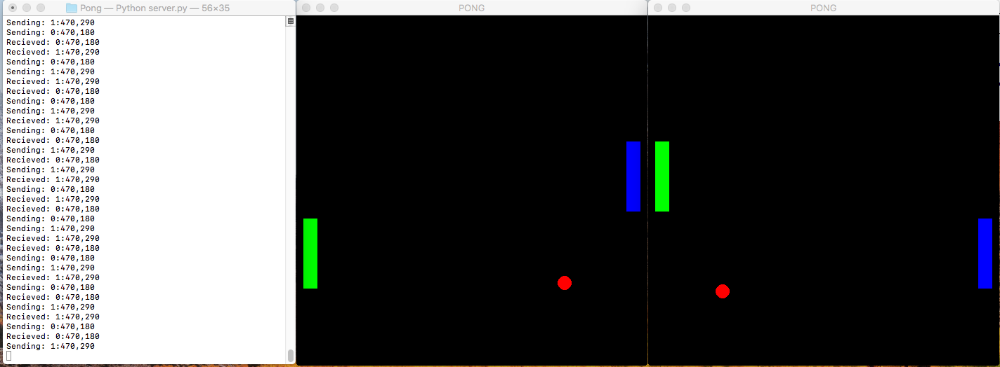

# Overview
This is a Pong game written in Python. It demonstates client to server networking using UDP.    

# Development Environment
* Visual Studio Code
* Python 3.8.5
* Pygame 2.0.0

# Execution
To execute the program:
1. Change the 'hostIPV4' in both the server.py and network files to the computer that will be used as a server's ipv4 address
2. You can use up to three computer on the same Wifi or just one
3. Open up the server: 'python3 server.py'
4. Open up the first player: 'python3 run.py'
5. Open up the second player: 'python3 run2.py'
6. As soon as the second player connects the ball will start moving.
7. Enjoy playing!

The players communitcate their positions through the server.
Both players apear blue and on the right of their own screen.

# Useful Websites
* [Socket Programming in Python (Guide)](https://realpython.com/python-sockets/)
* [Python Socket Libaries](https://docs.python.org/3.6/library/socket.html)
* [Difference Between TCP and UDP](https://docs.python.org/3.6/library/socket.html)
* [YouTube Sockets Tutorial with Python3](https://www.youtube.com/watch?v=Lbfe3-v7yE0&list=PLQVvvaa0QuDdzLB_0JSTTcl8E8jsJLhR5)
